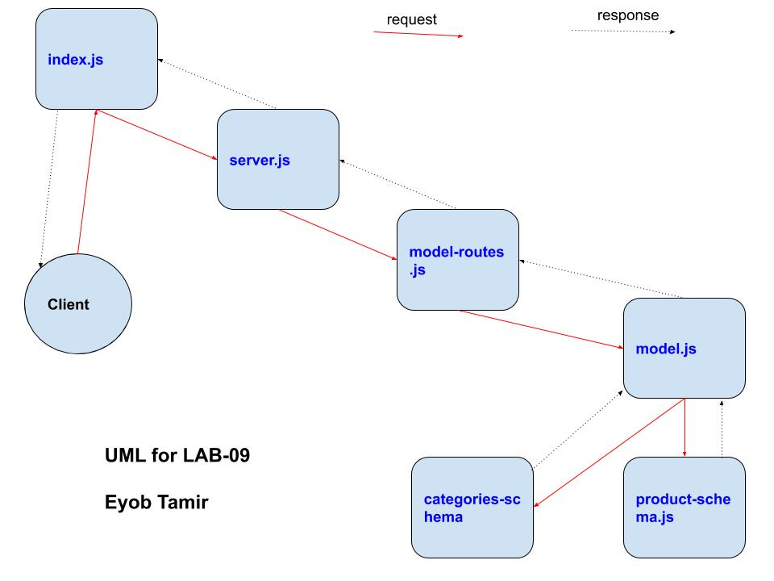

## LAB - Class 09

* Author: Eyob Tamir

### Links and Resources
[submission PR] () 

### back-end server url (when applicable)
* http//:localhosts:3000  - for home page *
* http//:localhosts:3000/api/v1/products  - for products page * 
* http//:localhosts:3000/api/v1/categories  - for categoris page *

### Heroku Link Home Page
*https://lab-09--api-server.herokuapp.com/*

### Heroku Link Products Page
*https://lab-09--api-server.herokuapp.com/api/v1/products*

### Heroku Link home Page
*https://lab-09--api-server.herokuapp.com/api/v1/categories*

### Swagger on Heroku Link
*https://lab-09--api-server.herokuapp.com/api-docs*

### Setup
* .env requirements *
 * For MONGO_URI *
 * PORT * 

### PORT - Port Number
    PORT-3000

### How to initialize/run your application 
 `npm start` || `nodemon`

### Tests
* jest --verbose --coverage

UML

